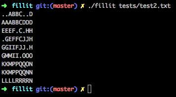

#fillit
  
Projet Ecole 42 (Paris)
  
##Synopsis
  
Le but de ce projet était de créer un programme qui agence une série de pièces de Tetris afin d'obtenir le plus petit carré possible pouvant les contenir. Fillit prend en argument un fichier decrivant la liste des pièces à agancer, le formatage doit être le même que celui des fichiers contenus dans le dossier tests. Le résultat est écrit sur la sortie standard, la première pièce est représentée avec la lettre A, la seconde avec B, etc.
  

